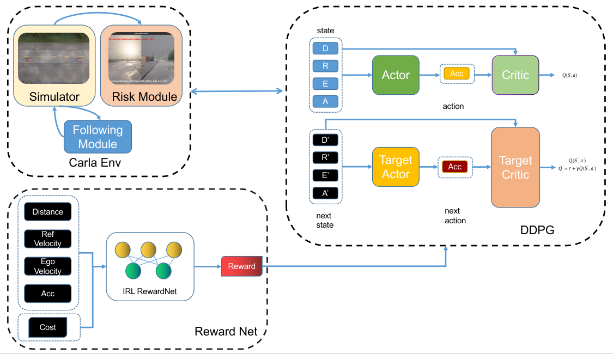
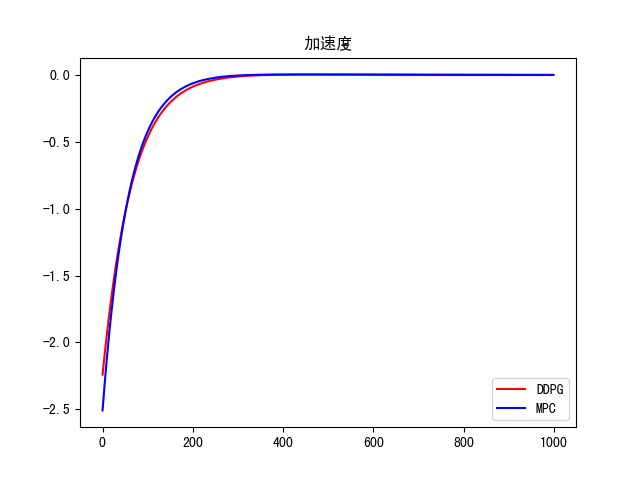

# Carla Follow DIRL 程序说明



## 1. 环境
```shell
python==3.7
pytorch==1.13.0
torchaudio=0.13.0=py37_cu117
torchvision=0.14.0=py37_cu117
```
carla版本和API要求：0.9.13
## 2. 程序组织
**训练说明：**
我们的程序中存在专家奖励网络和DDPG智能体的训练，首先需要训练专家奖励网络作逆向强化学习，涉及`Pre_Reward.py`和`RewardFun.py`，运行`Pre_Reward.py`即可获得奖励网络的权重文件。在本例中是`weights/Pre_RewardNet_new_func.pkl`，训练DDPG智能体运行`IDRL_train.py`（注意将TrainFlag设置为True），训练DDPG涉及 `IDRL_train.py`、`DDPG.py`、`CarFollowing.py`，运行结束得到DDPG RL算法智能体的模型权重，用于在环境中的推理。

**验证说明：**
根据我们的程序需求，我们考虑DDPG的策略网络输出的加速度和ego车辆本身的加速度作对照，因此我们的模型在Carla中验证，相关文件涉及`Env.py`、`RSSModel.py`，开启Carla的服务之后，运行`Env.py`即可，注意，`Env.py`需要加载训练后的DDPG权重文件，在本例中为`weights/ddpg_105.pt`。
> 具体文件功能如下列举，具体运行细节参考第3节运行说明
- `DDPG.py`：包含DDPG网络结构定义以及训练流程逻辑。
- `Env.py`：包含Carla环境跟车模型的实现与加速度预警判定以及显示。
- `IDRL_train.py`：包括RL智能体的训练逻辑以及奖励网络的微调，同时也包含模型的验证工作，目的是获得一个通过`当前速度`、`相对速度`、`相对车距`为输入，`加速度`为输出的策略网络。
- `Pre_Reward.py`：包括逆向强化学习的专家经验奖励网络的训练过程，目的是获得一个以`当前速度`、`相对速度`、`相对车距`、`加速度`为输入，`奖励值`为输出的奖励网络。
- `RSSModel.py`：RSS模型的实现，根据给定参数`反应时间`、`后车最大加速度`、`后车最大减速度`、`前车最大减速度`，计算`最小安全距离`。
- `RewardFun.py`：包含奖励网络的结构定义。
- `CarFollowing.py`：定义了跟车模型模拟交互环境的定义，通过计算的方式获得当前跟车状态。
## 3. 运行说明
为了灵活接管Carla BaseAgent的导航功能，在此对`basic_agent.py`进行了修改，改动在109行，源码位于`$CARLA_HOME/PythonAPI/carla/agents/navigation`下
```python
    def set_destination(self, end_location, start_location=None, blender=False):
        """
        This method creates a list of waypoints between a starting and ending location,
        based on the route returned by the global router, and adds it to the local planner.
        If no starting location is passed, the vehicle local planner's target location is chosen,
        which corresponds (by default), to a location about 5 meters in front of the vehicle.

            :param end_location (carla.Location): final location of the route
            :param start_location (carla.Location): starting location of the route
        """
        if not start_location:
            start_location = self._local_planner.target_waypoint.transform.location
            clean_queue = True
        elif blender:
            start_location = self._vehicle.get_location()
            clean_queue = True
            self._local_planner.target_waypoint = self._map.get_waypoint(self._vehicle.get_location())
        else:
            start_location = self._vehicle.get_location()
            clean_queue = False

        start_waypoint = self._map.get_waypoint(start_location)
        end_waypoint = self._map.get_waypoint(end_location)

        route_trace = self.trace_route(start_waypoint, end_waypoint)
        self._local_planner.set_global_plan(route_trace, clean_queue=clean_queue)
        return route_trace
```
### Demo运行
首先，程序基于Carla环境，在程序运行前，应当先行启动Carla环境
```shell
# Linux下启动脚本
$CARLA_HOME/CarlaUE4.sh
# Windows下直接运行UE4的程序
```
```shell
python Env.py
```
79行修改权重为DDPG训练好的权重
```python
self.ddpg = torch.load('/home/moresweet/gitCloneZone/DIRL/checkpoints/RSS/weights/ddpg_105.pt')
```

### 逆向强化学习专家网络
```shell
python Pre_Reward.py
```
源码最后一行为保存的权重名
```python
torch.save(Pre_RewardNet, 'Pre_RewardNet_new_func.pkl')
```

### RL DDPG 智能体训练
配置检查点（权重）保存目录
```python
checkpoint_dir = './checkpoints/RSS/weights'
```
98行修改专家经验预训练奖励网络的输入
```python
Pre_RewardNet = torch.load('./Pre_RewardNet_new_func.pkl', map_location=device)
```
73行修改训练标志，当其为`True`时，程序执行训练流程，当其为`False`时，程序执行验证模型效果的流程。
```shell
TrainFlag = True
```
## 4. 程序设计简要说明
Carla Env的设计中，对直线行驶的部分，后车将参考当前RSS模型根据固定参数完成油门和刹车的调整，以保证不会发生碰撞并保持安全车距，同时根据当前状态的观测，DDPG也会给出建议的加速度，如果差距越过给定阈值，会在显示窗口报警。
对于弯道跟车的部分，当前车进入弯道或者路口时，会在出口2秒后获取前车的位姿信息添加到队列中，当后车到达路口或者弯道，会取出队列中的前车位置waypoint进行导航，到达目的地后调整车头，以防直行行驶的车头并非正方向导致撞车。

专家预训练网络采用一层线性层完成对奖励值的输出，训练过程中会利用`(车距、当前相对速度、后车速度、加速度)`的四元组和`(奖励值)`的标签训练，其中，数据部分来自于均匀抽样的离散点和数据集中的输入数据，奖励值标签的来源是自己构建的代价function（定义如下式），模型不考虑时序，直接训练。
$$
d_{\text {min }}=v x \cdot t_{\text {reaction }}+\frac{v x^{2}}{2 \cdot a_{\max }}-\frac{(v x-v r)^{2}}{2 \cdot a_{\min }}\\
\begin{array}{l}
g=(vr+vx) \cdot t_{\text {reaction }} \\
H=\frac{2 \cdot \text { dis } \cdot d_{\min }}{\text { dis }+d_{\min }}
\end{array}\\
f=10 \cdot \operatorname{acc}^{2}+0.2 \cdot(g-\text { dis })^{2}+5 \cdot \mathrm{vr}^{2}+\left(\frac{1}{H}\right)^{2}
$$


对于DDPG的训练部分，采用经典的DDPG模型，奖励由预训练的奖励网络给出，同时，在训练40代后会对奖励网络进行微调，目标是让DDPG产生的奖励期望与专家网络的奖励期望能够相似。
对于DDPG的验证部分，会根据输入的模型，对一个跟车过程的MPC曲线对比拟合程度，采用曲线图的形式呈现。

